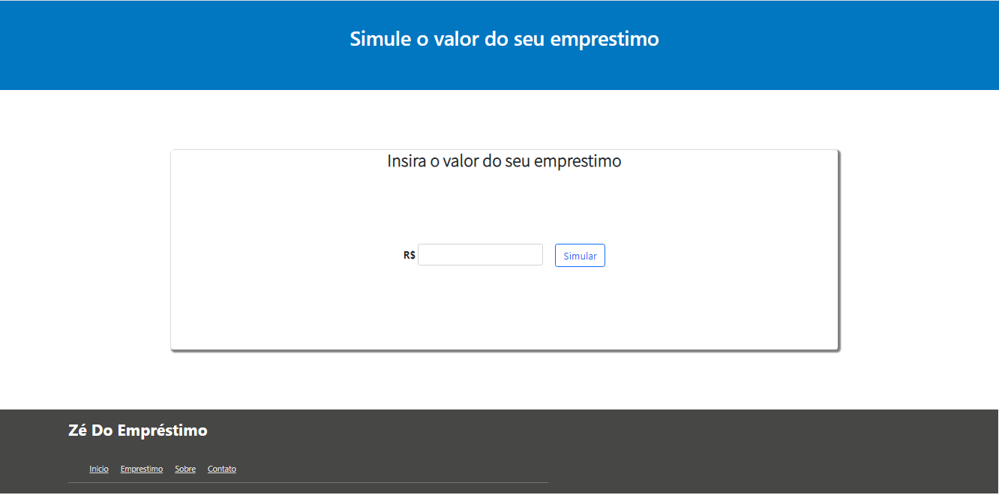
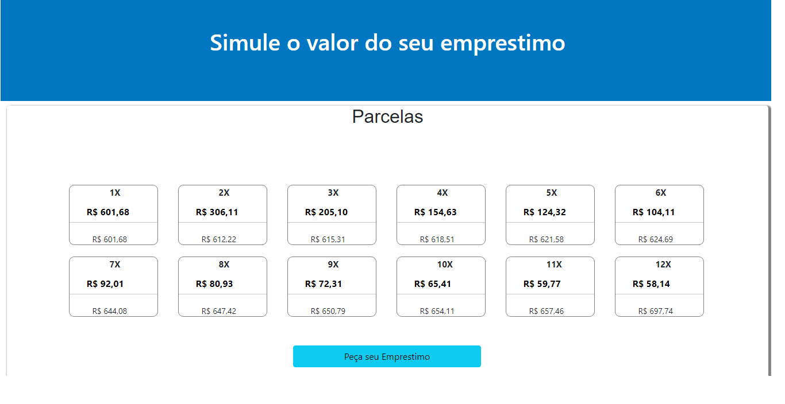

# Simulador de Empréstimo
## simulador de empréstimo feito para uma página do site [Ze do emprestimo](https://www.zedoemprestimo.com.br) 

### Objetivo
#### Simular Empéstimos para que os contratantes tenham uma noção.
# Foi construído em PHP bem simples apenas para fazer os calculos das parcelas do empréstimo.

## Telas 

### Index

### Taxas
